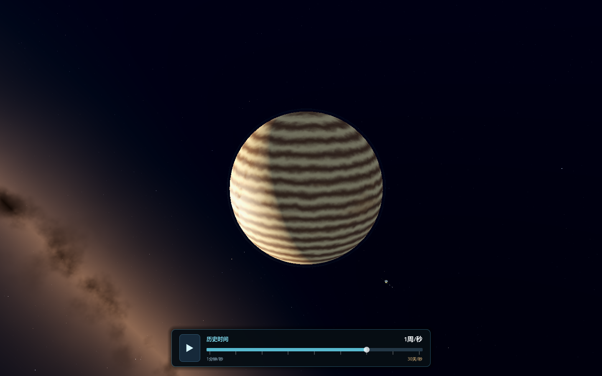
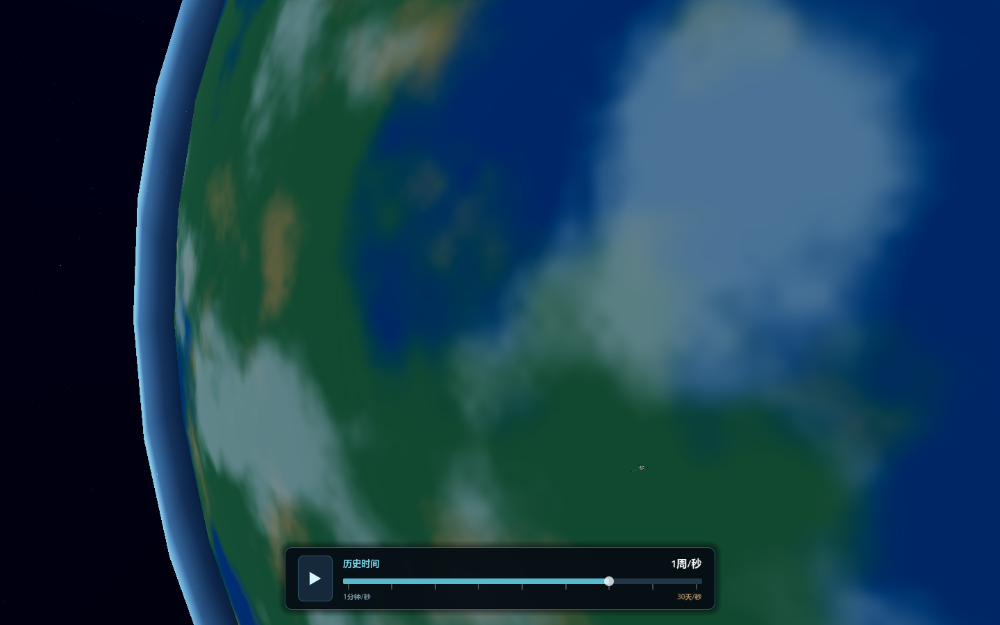
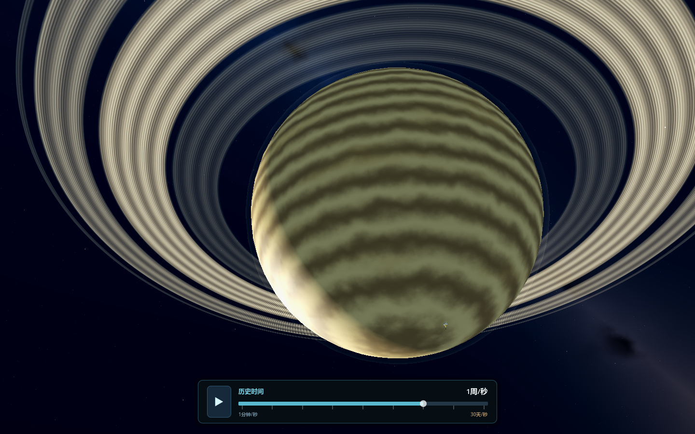
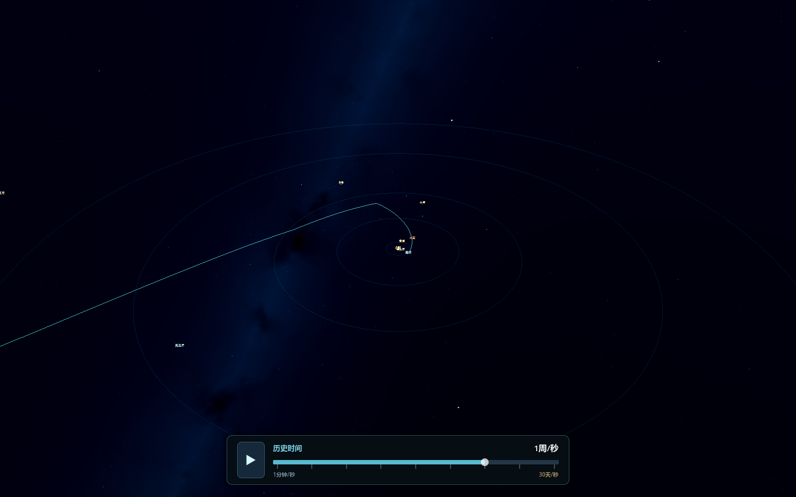

<p align="center">
  
  
  
  
  
</p>

# PhyzBox：旅行者太阳系

这是一个从 1977 年开始、由真实星历驱动的太阳系航行体验。当前主模式沿旅行者 1 号的历史轨迹回放：地球、月球、行星、太阳和探测器的位置与速度来自 JPL NAIF SPICE 内核，不是按关卡脚本摆放的动画。



主画面已经删除任务卡、大段文字和遥测面板，只在底部保留紧凑的播放 / 时间流速条。日期、播放状态与倍率也会显示在操作系统窗口标题；主要画面留给天体、旅行者号、真实星空和可选的太阳系轨道总览。

## 立即运行

已有发布包时：

```powershell
.\dist\PhyzBox.exe
```

从源码构建并运行：

```powershell
.\scripts\bootstrap_godot.ps1
.\scripts\build_all.ps1 -GodotTarget template_release -Jobs 4
.\scripts\run_game.ps1
```

需要 Godot 4.6.3。Windows 发布文件生成在 `dist/`。

## 怎么体验

启动时位于 1977-09-05 的第一段官方旅行者 1 号星历附近。此时探测器仍非常靠近地球，因此地球会越过画面边缘；这不是被放大的游戏图标，而是按真实半径与距离得到的角直径。

- `Space`：播放 / 暂停历史
- 拖动底部时间条：选择并显示当前时间流速（每秒 1 分钟至 30 天）；接近飞掠自动减速时会同时显示实际生效速度
- `+` / `-`：逐档提高 / 降低时间流速，和拖动条保持同步
- `A`：开关接近历史事件时的自动减速
- `M`：旅行者跟随镜头 / 太阳系总览
- `C`：任务可视化色彩 / 物理曝光
- `1`：1977 地球出发
- `2`：1979 木星飞掠
- `3`：1980 土星飞掠
- `4`：离开行星任务阶段
- `5`：2012 进入星际空间
- `←` / `→`：后退 / 前进 1 天；按住 `Shift` 时为 30 天
- 鼠标拖动：环绕镜头
- 鼠标滚轮：改变观察距离
- `Home`：回到历史起点
- `Esc`：退出



默认使用面向观众与航天传播画面的“任务可视化”色彩：提升暗部、局部对比和色彩辨识度，但不改变任何轨道、距离、半径或时间数据。火星使用氧化铁红褐色域，土星使用浅金色云带与程序化薄环，海王星使用深钴蓝色域；深空背景由纯黑改为低亮度深海军蓝，并保留银河暖尘与冷色散射。按 `C` 可随时切回更克制的物理曝光。



## 这次为什么更像物理引擎

- 行星和探测器状态来自 [JPL NAIF Voyager SPK](https://naif.jpl.nasa.gov/pub/naif/VOYAGER/kernels/spk/) 与 DE440s 星历，运行时使用双精度三次 Hermite 插值。
- 轨迹覆盖 1977–2030；行星飞掠附近使用小时级采样，其他时段使用日 / 周级采样。
- 距离、速度、最近天体和事件减速均从星历状态实时计算。
- 跟随视图使用双尺度渲染：物理状态保持 km，画面在相机局部重建，因此既能表现“飞船极小、行星极大”，也不会损失远日行星的浮点精度。
- 太阳系总览才使用 AU 尺度和可读性图标；这些显示尺寸不会回写物理状态。
- 旧的五关轨道任务与 `libphyz` 有限推力 / N-body 能力仍作为实验与后续自由飞行基础保留，但不再作为默认主界面。

## 真实星空与程序化美术

背景没有使用 AI 生成贴图或随机宇宙全景。运行包包含从 NASA HEASARC 查询得到的 83,337 颗 Hipparcos 恒星：

- 天球方向：ICRS / J2000
- 亮度：Johnson V 视星等
- 恒星颜色：B−V 色指数估算色温
- 银河方向：按 J2000 银河北极和银河中心方向固定
- 银河尘埃与散射：Godot shader 实时渲染，不使用位图贴图
- 色彩分级：Filmic 曝光、暗部抬升和适度饱和度增强，仅作用于显示；不是伪造星历，也不是 AI 贴图

星表来源与哈希记录在 `godot/data/hipparcos_bright.json`；旅行者内核来源与哈希记录在 `godot/data/voyager_ephemeris.json`。数据版权与署名遵循各自来源要求，Hipparcos catalogue credit: ESA。



## 数据再生成

仓库已经包含运行所需的压缩数据。需要从官方源重新生成时：

```powershell
$env:PYTHONPATH = (Resolve-Path .tools\python).Path
python .\tools\import_voyager_ephemeris.py
python .\tools\import_hipparcos_stars.py
```

导入器会把下载缓存放在忽略提交的 `.runtime/`，并生成可审计的来源、筛选条件与 SHA-256 元数据。

## 验证

```powershell
.\.tools\godot\Godot_v4.6.3-stable_win64_console.exe --headless --path .\godot --script res://scripts/voyager_test_runner.gd
.\scripts\build_all.ps1 -GodotTarget template_release -Jobs 4
```

测试覆盖星历载入、历史距离、时间拖动条与快捷键同步、事件跳转、太阳系视图、真实星表数量，以及主场景只保留紧凑时间控制层。

项目结构与物理库说明见 [godot/README.md](godot/README.md)、[libphyz/README.md](libphyz/README.md) 和 [IMPLEMENTATION_REPORT.md](IMPLEMENTATION_REPORT.md)。

## 科学实验室

> 🌌 *Three-body problem → Astrophysical sandbox — see [project history](CHANGELOG.md).*

---

一个纯 C++20 / Win32 / OpenGL 的 3D 天体物理沙盘模拟器。默认场景是非共面的混沌三体，三个天体的位置和轨迹全部由实时万有引力积分得到，不是预制动画。

物理计算使用天文单位制：距离为 AU，质量为太阳质量，时间为年，引力常数为 `G = 4π² AU³ / (M☉·yr²)`。它不需要联网下载依赖，当前工作空间里用 MinGW `g++` 就能直接构建。

## 构建

```powershell
powershell -ExecutionPolicy Bypass -File .\build.ps1
```

或者：

```bat
build.bat
```

手动编译命令：

```powershell
g++ -std=c++20 -O2 -Wall -Wextra -pedantic src\*.cpp -o bin\PhyzBox.exe -lopengl32 -lgdi32 -luser32 -static-libgcc -static-libstdc++
```

## 运行

```powershell
.\bin\PhyzBox.exe
```

无窗口物理自检：

```powershell
.\bin\PhyzBox.exe --self-test
.\bin\PhyzBox.exe --self-test-explorer
```

## 操作

- 鼠标左键拖动：旋转相机
- 鼠标滚轮：缩放
- `Space`：暂停 / 继续
- `R`：重置当前场景
- `0`：重新读取 `phyzbox.ini` 并切换到自定义初始条件
- `1`：混沌三体主场景
- `2`：经典 figure-eight 三体轨道
- `3`：倾斜平面的 3D 拉格朗日三角三体
- `4`：双星 + 第三天体的层级系统
- `5`：飞行器借巨行星引力弹弓加速的演示场景
- `6`：自洽行星系统，所有恒星、行星和飞船都由同一个 N-body 核心推进
- `+` / `-`：加快 / 减慢基准模拟速度
- 拖动画面左上角的 `Base speed` 滑条：连续调节基准模拟速度
- `A`：开启 / 关闭自动时间倍率
- `C`：显示 / 隐藏混沌敏感性影子系统
- `E`：编辑模式，暂停后可拖动天体；按住 `Shift` 拖动改变 z 高度
- `H`：显示 / 隐藏引力场箭头
- `M`：开启 / 关闭碰撞合并
- `P`：显示 / 隐藏无质量测试粒子
- `T`：显示 / 隐藏轨迹
- `X`：导出当前快照到 `exports/phyzbox_snapshot.csv`
- `G`：显示 / 隐藏参考轨道环
- `O`：开启 / 关闭自动环绕相机
- `F`：切换相机跟随目标
- `Esc`：退出

探索模式专用驾驶：

- `W` / `S`：前进 / 反推
- `A` / `D`：左 / 右平移
- `Q` / `E`：下 / 上平移
- `Shift`：加力推进
- `Ctrl`：逆速度方向的有限推力制动（不是空气阻尼）

## 实现概览

- 物理核心：`src/NBodySystem.*`
- 初始条件配置：`src/SimulationConfig.*`
- 向量与矩阵数学：`src/Math3D.hpp`
- OpenGL 渲染与 HUD：`src/Renderer.*`
- Win32 窗口与输入：`src/Application.*`
- 开发日志与疑难记录：`DEVELOPMENT_LOG.md`

积分器使用四阶 Yoshida 辛积分，并在近距离交会时自动细分步长；这比朴素欧拉或普通二阶 Verlet 更适合长时间天体轨道演示。引力计算带很小的软化项，避免点质量奇点导致数值爆炸。每一对有质量天体使用对称的成对力更新，因此牛顿引力和 Paczynski-Wiita 强场近似都保持线动量守恒；势能诊断与实际采用的力模型一致。混沌场景不会闭合成稳定轨道，微小初始差异会在数值积分中迅速放大，这就是三体问题最迷人的部分。

默认开启自动时间倍率：天体距离较远时稍微加快，近距离飞掠时自动慢下来，方便观察关键交会。`+` / `-` 调整的是基准倍率，HUD 会同时显示实际倍率和基准倍率。

HUD 会明确显示积分器、活动 N-body 数量、时间步、能量漂移、角动量漂移、线动量残差、最近距离、系统状态和事件日志。屏幕上的球体半径只是显示半径；碰撞、洛希极限、逃逸速度等计算使用独立的真实物理半径。

物理与可视化增强：

- 碰撞合并：距离小于真实碰撞半径时按动量守恒合并天体。
- 无质量测试粒子：显示空间中受引力牵引的流线，但不反向影响恒星。
- 混沌影子系统：以 `1e-6 AU` 的初始扰动同时积分，用紫色幽影显示敏感性。
- 引力场箭头：`H` 打开后在参考面上显示局部引力方向。
- 编辑模式：`E` 进入后可直接拖动天体重新设置初始条件。
- 天体自转：每个球体都有自转轴、周期和实时推进的自转角，表面经纬线会随时间转动。
- 飞行器/引力弹弓：`spacecraft` 类型会作为低质量真实受力体积分，靠运动行星的引力飞掠自然改变速度，HUD 会显示飞行器速度、速度增益和最近飞掠距离。
- 自洽行星系统：`6` 号场景用固定 seed 生成一颗主恒星、32 个不同质量/偏心率/倾角的天体和一艘低质量飞船。初始状态来自轨道力学，但之后不再回写解析轨道；全部天体参加同一套成对引力计算，扰动、进动、散射和碰撞都由状态自然演化。飞船操控只增加有限外力，没有速度上限、真空阻尼、视觉球体反弹或位置吸附。

飞船靠近行星时，状态和事件使用物理接触距离及 Hill 球，而不是为了渲染而放大的球体尺寸。当前模型仍未包含大气、地形、刚体姿态、燃料和完整广义相对论；这些不会被伪装成预设好的游戏规则。

### 引擎设计参考

- [REBOUND](https://rebound.hanno-rein.de/)：N-body 状态由积分器推进，并针对长周期系统、近距离交会选择不同积分策略。
- [REBOUNDx](https://reboundx.readthedocs.io/en/latest/)：把广义相对论、潮汐等额外物理作为可组合效应加入，而不是写成场景动画。
- [Orekit numerical propagation](https://www.orekit.org/static/apidocs/org/orekit/propagation/numerical/NumericalPropagator.html)：区分状态、数值积分和可组合力模型。
- [NASA GMAT propagator](https://documentation.help/GMAT/Propagator.html)：由积分器与 ForceModel 共同传播轨道状态。

## 自定义初始条件

复制 `phyzbox.ini.example` 为 `phyzbox.ini`，即可设置初始天体数量和位置。没有 `phyzbox.ini` 时会使用默认三体场景；配置中没写的字段会自动补默认值。

常用字段：

```ini
body_count = 4

[body0]
position = -1.30, -0.20, 0.35
velocity = 0.60, 2.40, -0.70
mass = 1.4

[body1]
position = 1.15, -0.75, -0.25
```

支持字段包括 `name`、`type`、`mass`、`radius`、`physical_radius`、`density`、`temperature`、`luminosity`、`spin_axis`、`rotation_period`、`rotation_angle`、`color`、`position`、`velocity`。单位仍然是 AU、太阳质量、年；速度单位是 AU/year。`radius` 是屏幕可视半径，`physical_radius` 是碰撞合并和洛希极限判定用的真实半径；`rotation_period` 单位是年，`rotation_angle` 单位是角度。

`presets/` 里有几个示例场景，可以复制为 `phyzbox.ini` 后按 `0` 重新加载：

- `presets/close-encounter.ini`
- `presets/four-body-chaos.ini`
- `presets/black-hole-tde.ini`
- `presets/compact-remnants.ini`
- `presets/gravity-assist.ini`
- `presets/merger-lab.ini`

## 天体类型和强场效果

配置中的 `type` 支持：

- `star`
- `planet`
- `black_hole`
- `neutron_star`
- `white_dwarf`
- `minor_body`
- `spacecraft`

不同类型会自动估算真实半径、密度、温度、亮度和默认颜色。黑洞会使用史瓦西半径 `Rs = 2GM/c²`、事件视界吞噬、`ISCO = 3Rs` 参考内缘和吸积盘视觉；近黑洞引力使用 Paczynski-Wiita 伪牛顿势，能表现强场轨道进动和捕获趋势。它不是完整数值相对论求解器；真正完整 GR 需要求解动态时空度规和爱因斯坦场方程。这里实现的是适合实时交互的强场近似层。

洛希极限会根据天体密度/质量比估算。行星、小天体或恒星进入强潮汐区时会触发 `tidal disruption` 事件，并被撕成测试粒子流；如果主天体是黑洞，碎片会增强吸积盘亮度。

---

## Contributing

Contributions are welcome! See [CONTRIBUTING.md](CONTRIBUTING.md) for details.

- 🐛 **Report bugs** via [GitHub Issues](../../issues)
- 💡 **Suggest features** via [Feature Requests](../../issues/new?template=feature_request.md)
- 📖 **Improve docs** — typos, English translations, new preset scenarios
- 🛠 **Submit PRs** — see the [PR checklist](CONTRIBUTING.md#pull-request-checklist)

## License

[MIT](LICENSE) © 2026 hydarealman

---

*PhyzBox — Where gravity is the only dependency.*
